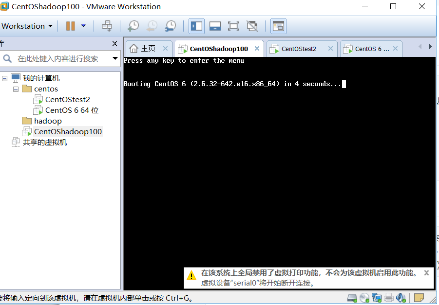
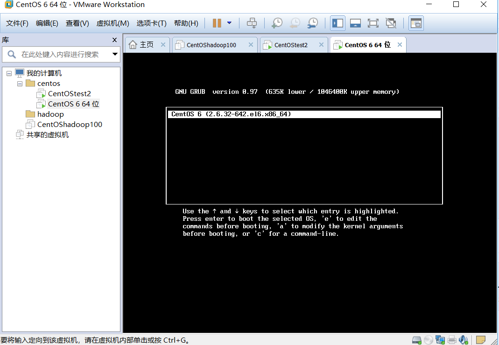
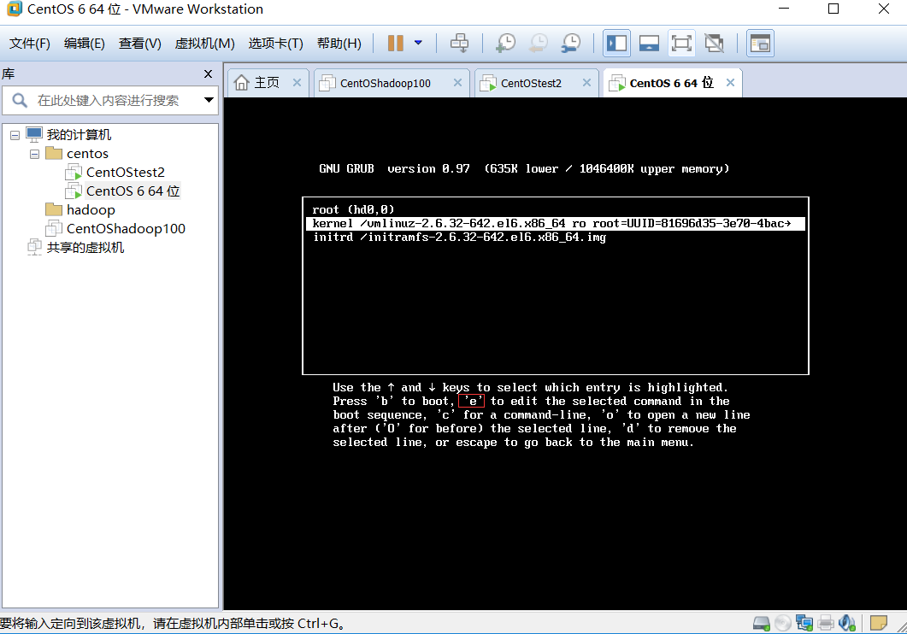
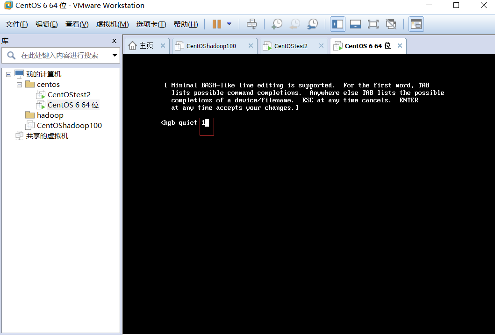
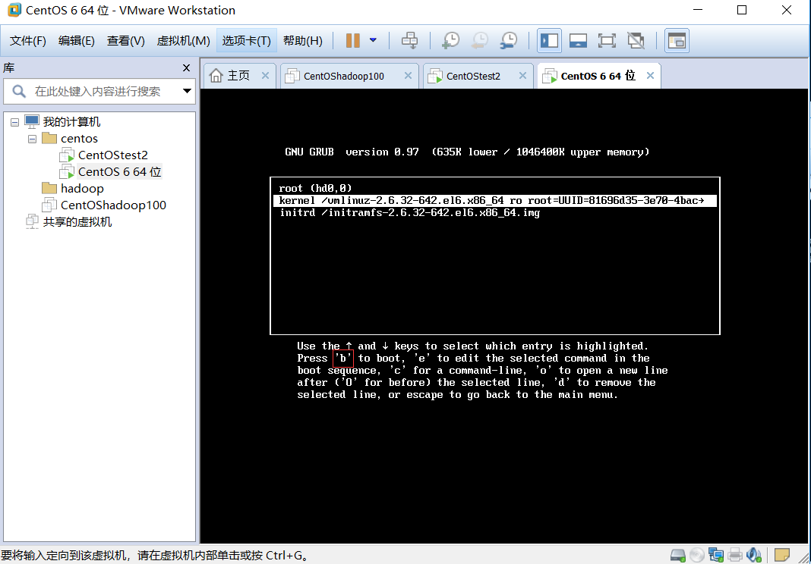
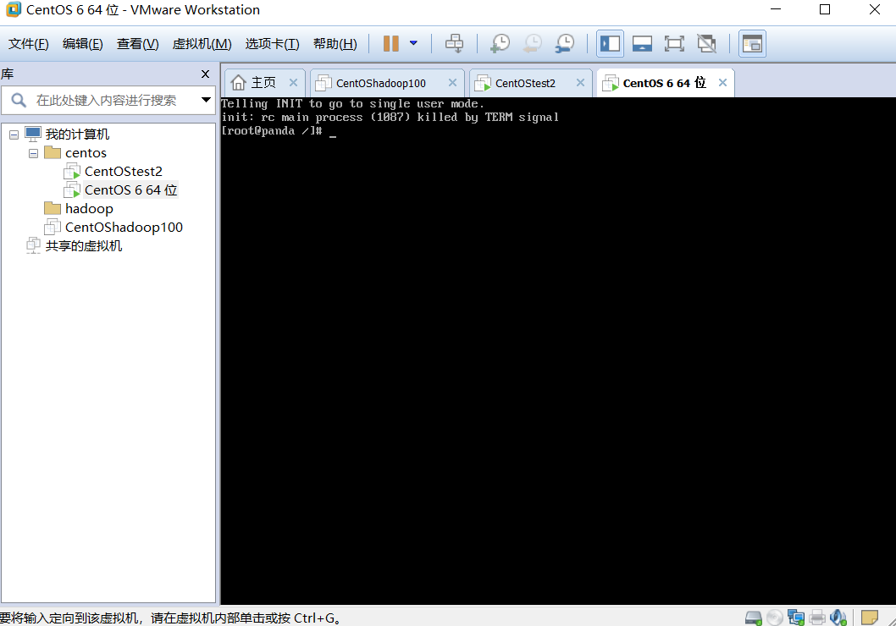

## Linux忘记root用户密码，并解决问题

~~~
最可怕的事，
~~~

## Linux运行级别：

~~~
1)0 ：关机 
2)1 ：单用户 [类似安全模式， 这个模式可以帮助找回root密码]
3)2：多用户状态没有网络服务
4)3：多用户状态有网络服务 [使用最多]
5)4：系统未使用保留给用户
6)5：图形界面 【】
7)6：系统重启  
~~~

## root密码忘记别慌

~~~
解决方案：我们可以进入单用户模式将密码修改回来，
启动虚拟机---》在引导时按enter键---》输入e---》选择第二行 ---》在输入e---》在输入空格 1，---》然后输入enter回到引导---输入b--》开始进入到单用户模式--》修改密码即可
~~~

~~~
按enter键：
~~~

~~~ 
输入e
~~~

~~~
选择第二行，输入e
~~~

~~~
输入空格1，然后enter返回引导
~~~

~~~
按b进入引导，进入单用户模式
~~~

~~~	
进入到单用户模式
~~~

~~~
修改密码不用我教吧，在自己切换一下运行模式
~~~

