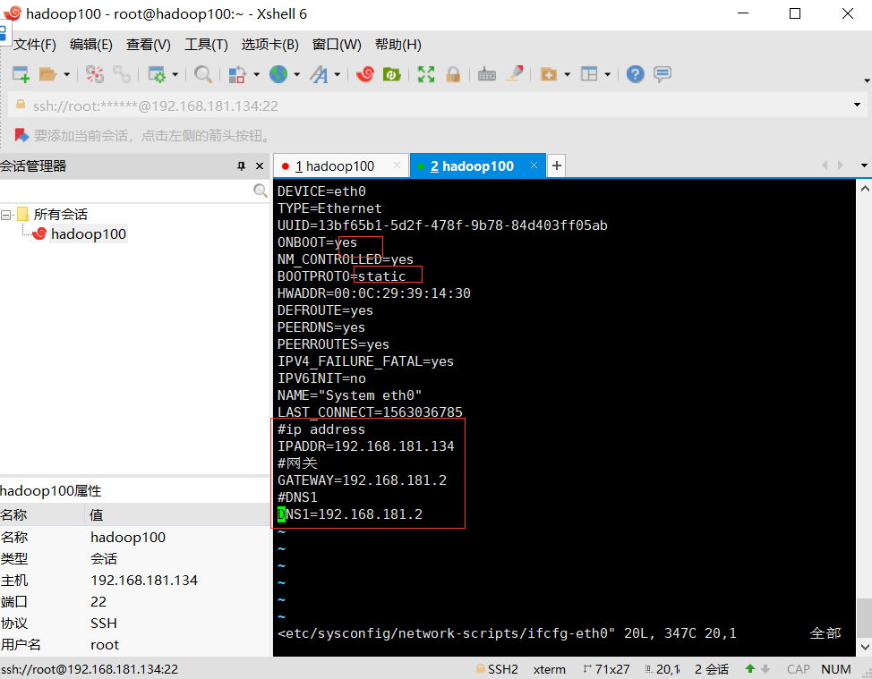
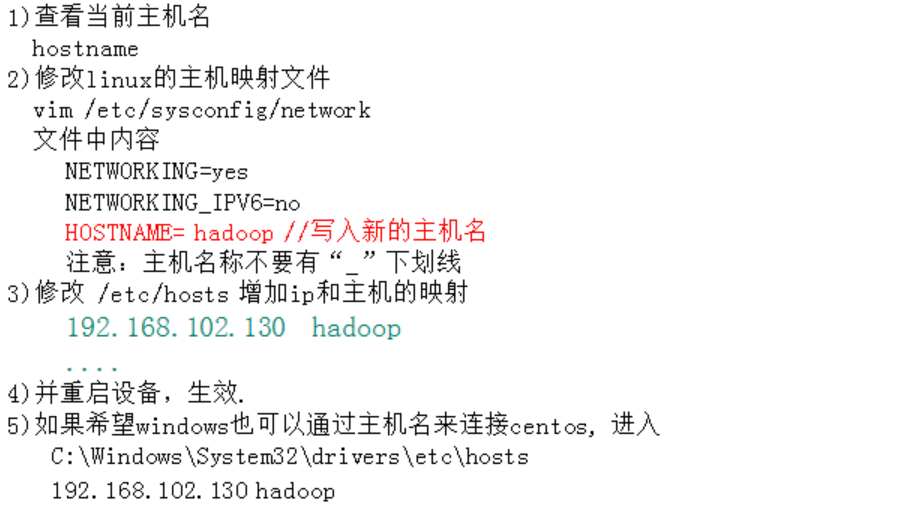

## 学习笔记七

珍珍：

~~~
学习吧，努力吧。我可以的，你一定是我的。
~~~

## 网络配置

1.自动获取Ip

​	每次都会获取不同的ip

2.静态ip配置

vim  /etc/sysconfig/network-scripts/ifcfg-eth0

1) reboot 

2) service network restart // 重启网络服务

### 配置主机名

