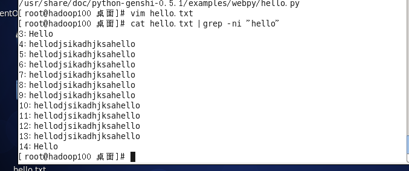

### 我的目标

~~~
爱一个女孩子，与其为她的幸福而放弃，不如留住她，为她的幸福而努力
~~~

## 帮助指令

~~~
man：
基础语法： man [命令或配置文件] 如：man ls
help:
语法：help 【命令】 如：help mkdir
不知道的可以百度或谷歌
~~~

## 基本命令

pwd: 显示当前工作的目录的绝对路径

ls：

ll：

ln：

rm：

mv：

cp：

tail：

more：

history：

## 日期指令

~~~
1) date	（功能描述：显示当前时间）
2) date +%Y	（功能描述：显示当前年份）
3) date +%m	（功能描述：显示当前月份） 
4) date +%d	（功能描述：显示当前是哪一天）
5) date "+%Y-%m-%d %H:%M:%S"（功能描述：显示年月日时分秒）
~~~

使用date指令设置最新时间

~~~
date  -s  字符串时间
如：date -s "2019-07-18 22:28"
~~~

日历

~~~
cal：
~~~

## 查找指令

find指令：

~~~
find：指令将从指定目录向下递归地遍历其各个子目录，将满足条件的文件或者目录显示在终端
语法：find [搜索范围] 【选项】
如：find /opt -name hello.txt
   find /opt -user hello.txt
   find /opt -size +10M
~~~

local指令：

~~~
locate指令可以快速定位文件路径。locate指令利用事先建立的系统中所有文件名称及路径的locate数据库实现快速定位给定的文件。Locate指令无需遍历整个文件系统，查询速度较快。为了保证查询结果的准确度，管理员必须定期更新locate时刻
如：update
   locate 文件名	
~~~

grep指令：

~~~
grep 过滤查找 ， 管道符，“|”，表示将前一个命令的处理结果输出传递给后面的命令处理。
语法：grep [属性]
属性-n：显示匹配的行及行号
属性-i：忽略字母大小写
如：cat hello.txt|grep -ni "hello"
~~~

## 压缩与解压

gzip 用于压缩文件， gunzip 用于解压的

tar指令：

~~~
 tar 指令 是打包指令，最后打包后的文件是 .tar.gz 的文件。 [可以压缩，和解压]
~~~

