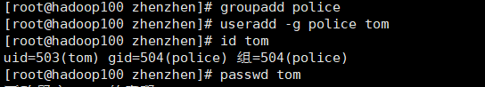
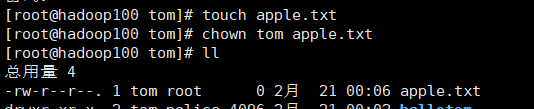
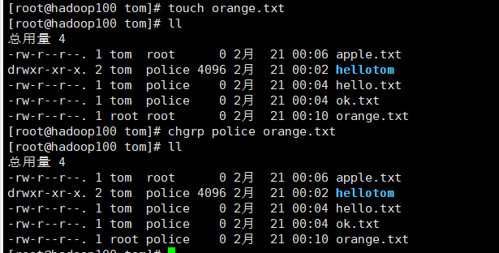
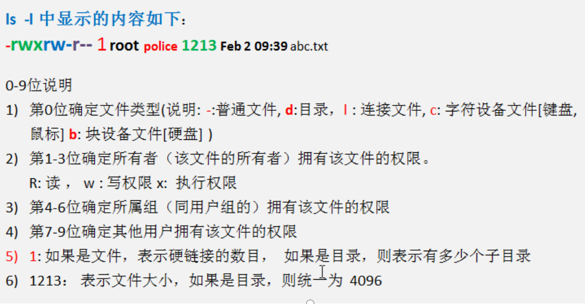
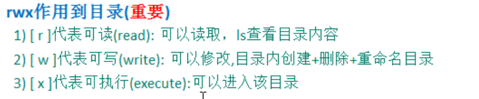
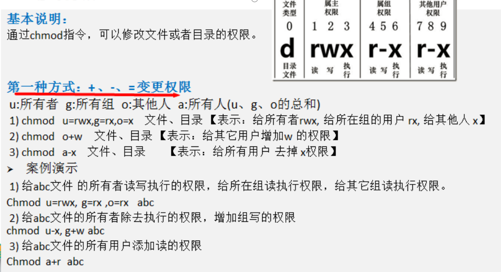
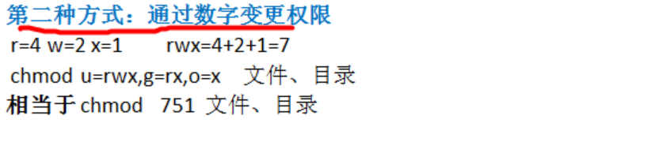
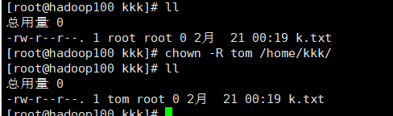

## 每日笔记四

~~~
我的过去属于黑暗，我的未来属于你，珍珍
~~~

## 权限管理

~~~
在linux中的每个用户必须属于一个组，不能独立于组外。在linux中每个文件
有所有者、所在组、其它组的概念。
~~~

应用实例 :创建一个组police,再创建一个用户tom,将tom放在police组 ,然后使用 tom来创建一个文件 ok.txt，看看情况如何

~~~

~~~

 ### chown 用户名 文件名 

~~~

~~~

### chgrp 组名 文件名

~~~
使用root用户创建文件 orange.txt ,看看当前这个文件属于哪个组【root】，然后将这个文件所在组，修改到 police组。
~~~

### 权限详解

## 修改权限chmod

