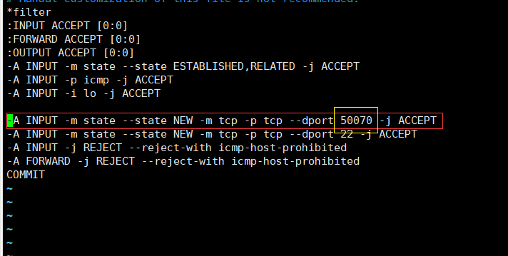

## Linux命令集合：

1.查看设备网卡：

~~~
vim /etc/udev/rules.d/70-persistent-net.rules 
~~~

2.查看网络配置

~~~
vim /etc/sysconfig/network-scripts/ifcfg-eth0 
~~~

3.重启网络

~~~
 service network restart
~~~

4.修改主机名

~~~
linux:
vim /etc/sysconfig/network
windows:
C:\Windows\System32\drivers\etc
~~~

5.查看防火请状态

~~~
service iptables status
service iptables stop  关闭防火墙
service iptables start 打开防火墙
~~~

6.修改用户具有root的权限

~~~
vim /etc/sudoers
 sudo mkdir software
~~~

7.jdk安装

~~~
##JAVA_HOME
export JAVA_HOME=/opt/module/jdk1.8.0_144
export PATH=$PATH:$JAVA_HOME/bin
切换jdk默认路径
alternatives --install /usr/bin/java java /opt/module/jdk1.8.0_144/bin/java 300
alternatives --config java
~~~

8.配置主机

~~~
 vim /etc/sysconfig/network
 vim /etc/hosts
~~~

9.配置外部访问的端口

~~~
[root@hadoop102 ~]# vim /etc/sysconfig/iptables
~~~

~~~
直接配置外部访问端口：
/sbin/iptables -I INPUT -p tcp --dport 3306 -j ACCEPT
~~~

