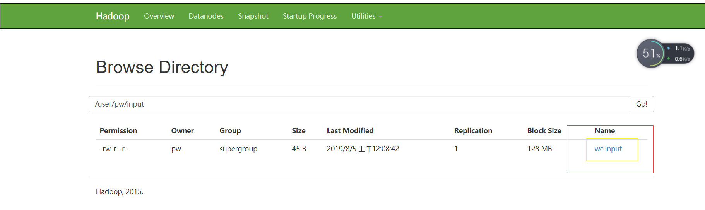

## hadoop安装模式

## 本地运行模式

1.创建在hadoop-2.7.2文件下面创建一个input文件夹

~~~
mkdir input
~~~

2.将Hadoop的xml配置文件复制到input

~~~
cp etc/hadoop/*.xml input
~~~

3.执行share目录下的MapReduce程序

~~~
 bin/hadoop jar share/hadoop/mapreduce/hadoop-mapreduce-examples-2.7.2.jar grep input output 'dfs[a-z.]+'
~~~

4.查看输出结果

~~~
cat output/*
~~~

### 官方WordCount案例

1.创建在hadoop-2.7.2文件下面创建一个wcinput文件夹

~~~
[pw@hadoop101 hadoop-2.7.2]$ mkdir wcinput
~~~

2.在wcinput文件下创建一个wc.input文件

~~~
[pw@hadoop101 hadoop-2.7.2]$ cd wcinput/
[pw@hadoop101 wcinput]$ touch wc.input
~~~

3.编辑wc.input文件

~~~
在文件中输入如下内容
hadoop yarn
hadoop mapreduce
atguigu
atguigu
~~~

4.回到Hadoop目录/opt/module/hadoop-2.7.2

~~~
[pw@hadoop101 wcinput]$ cd ..
~~~

5.执行程序

~~~
[pw@hadoop101 hadoop-2.7.2]$ hadoop jar share/hadoop/mapreduce/hadoop-mapreduce-examples-2.7.2.jar wordcount wcinput wcoutput
~~~

6.查看结果

~~~
[pw@hadoop101 hadoop-2.7.2]$ cat wcoutput/part-r-00000
~~~

## 伪分布模式

~~~
1.	分析
	（1）配置集群
	（2）启动、测试集群增、删、查
	（3）执行WordCount案例
~~~

### 配置集群

1.配置：hadoop-env.sh

~~~
Linux系统中获取JDK的安装路径：
[pw@hadoop102 hadoop-2.7.2]$ echo $JAVA_HOME
/opt/module/jdk1.8.0_144
修改JAVA_HOME 路径：
[pw@hadoop102 hadoop-2.7.2]$ vim etc/hadoop/hadoop-env.sh 

~~~

2.配置：core-site.xml

~~~
[pw@hadoop102 hadoop-2.7.2]$ vim etc/hadoop/core-site.xml 

<!-- 指定HDFS中NameNode的地址 -->
<property>
<name>fs.defaultFS</name>
    <value>hdfs://hadoop102:9000</value>
</property>

<!-- 指定Hadoop运行时产生文件的存储目录 -->
<property>
	<name>hadoop.tmp.dir</name>
	<value>/opt/module/hadoop-2.7.2/data/tmp</value>
</property>
~~~

3.配置：hdfs-site.xml

~~~
[pw@hadoop102 hadoop-2.7.2]$ vim etc/hadoop/hdfs-site.xml 
<!-- 指定HDFS副本的数量 -->
<property>
	<name>dfs.replication</name>
	<value>1</value>
</property>
~~~

### 启动集群

1.格式化NameNode（第一次启动时格式化，以后就不要总格式化）

~~~
[pw@hadoop102 hadoop-2.7.2]$ bin/hdfs namenode -format
~~~

2.启动NameNode

~~~
[pw@hadoop102 hadoop-2.7.2]$ sbin/hadoop-daemon.sh start namenode
~~~

3.启动DataNode

~~~
[pw@hadoop102 hadoop-2.7.2]$ sbin/hadoop-daemon.sh start datanode
~~~

### 查看集群

1.查看是否启动成功

~~~
[pw@hadoop102 hadoop-2.7.2]$ jps
3013 NameNode
3181 Jps
3103 DataNode

~~~

2.web端查看HDFS文件系统

~~~
http://192.168.181.102:50070/
~~~

3.查看产生的Log日志

~~~
[pw@hadoop102 logs]$ cd /opt/module/hadoop-2.7.2/logs/
[pw@hadoop102 logs]$ ll
总用量 60
-rw-rw-r--. 1 pw pw 23903 8月   4 23:33 hadoop-pw-datanode-hadoop102.log
-rw-rw-r--. 1 pw pw   713 8月   4 23:33 hadoop-pw-datanode-hadoop102.out
-rw-rw-r--. 1 pw pw 27524 8月   4 23:33 hadoop-pw-namenode-hadoop102.log
-rw-rw-r--. 1 pw pw   713 8月   4 23:32 hadoop-pw-namenode-hadoop102.out
-rw-rw-r--. 1 pw pw     0 8月   4 23:32 SecurityAuth-pw.audit

~~~

### 操作集群

1.在HDFS文件系统上**创建**一个input文件夹

~~~
[pw@hadoop102 hadoop-2.7.2]$ bin/hdfs dfs -mkdir -p /user/pw/input
~~~

2.将测试文件内容**上传**到文件系统上

~~~
[pw@hadoop102 hadoop-2.7.2]$ bin/hdfs dfs -put wcinput/wc.input  /user/pw/input/
~~~

3.**查看**上传的文件是否正确

~~~
[pw@hadoop102 hadoop-2.7.2]$ bin/hdfs dfs -ls /user/pw/input
Found 1 items
-rw-r--r--   1 pw supergroup         45 2019-08-05 00:08 /user/pw/input/wc.input
[pw@hadoop102 hadoop-2.7.2]$ bin/hdfs dfs -cat /user/pw/input/wc.input
hadoop yarn
hadoop mapreduce
atguigu
atguigu

~~~

4.运行MapReduce程序

~~~
[pw@hadoop102 hadoop-2.7.2]$  bin/hadoop jar share/hadoop/mapreduce/hadoop-mapreduce-examples-2.7.2.jar wordcount /user/pw/input/ /user/pw/output

~~~

5.查看输出结果

~~~
[pw@hadoop102 hadoop-2.7.2]$ bin/hdfs dfs -cat /user/pw/output/*
atguigu	2
hadoop	2
mapreduce	1
yarn	1
~~~

6.将测试文件内容**下载**到本地

~~~

~~~

7.**删除**输出结果

~~~

~~~

（1）配置集群

​		（a）配置：hadoop-env.sh

Linux系统中获取JDK的安装路径：

[atguigu@ hadoop101 ~]# echo $JAVA_HOME

/opt/module/jdk1.8.0_144

修改JAVA_HOME 路径：

export JAVA_HOME=/opt/module/jdk1.8.0_144

（b）配置：core-site.xml

<!-- 指定HDFS中NameNode的地址 --><property><name>fs.defaultFS</name>    <value>hdfs://hadoop101:9000</value></property> <!-- 指定Hadoop运行时产生文件的存储目录 --><property>	<name>hadoop.tmp.dir</name>	<value>/opt/module/hadoop-2.7.2/data/tmp</value></property>

（c）配置：hdfs-site.xml

<!-- 指定HDFS副本的数量 --><property>	<name>dfs.replication</name>	<value>1</value></property>

（2）启动集群

（a）**格式化****NameNode**（第一次启动时格式化，以后就不要总格式化）

[atguigu@hadoop101 hadoop-2.7.2]$ bin/hdfs namenode -format

​		（b）启动NameNode

[atguigu@hadoop101 hadoop-2.7.2]$ sbin/hadoop-daemon.sh start namenode

​		（c）启动DataNode

[atguigu@hadoop101 hadoop-2.7.2]$ sbin/hadoop-daemon.sh start datanode

（3）查看集群

​		（a）查看是否启动成功

[atguigu@hadoop101 hadoop-2.7.2]$ jps

13586 NameNode

13668 DataNode

13786 Jps

注意：jps是JDK中的命令，不是Linux命令。不安装JDK不能使用jps

​		（b）web端查看HDFS文件系统

<http://hadoop101:50070/dfshealth.html#tab-overview>

注意：如果不能查看，看如下帖子处理

<http://www.cnblogs.com/zlslch/p/6604189.html>

​		（c）查看产生的Log日志

​		  说明：在企业中遇到Bug时，经常根据日志提示信息去分析问题、解决Bug。

当前目录：/opt/module/hadoop-2.7.2/logs

[atguigu@hadoop101 logs]$ ls

hadoop-atguigu-datanode-hadoop.atguigu.com.log

hadoop-atguigu-datanode-hadoop.atguigu.com.out

hadoop-atguigu-namenode-hadoop.atguigu.com.log

hadoop-atguigu-namenode-hadoop.atguigu.com.out

SecurityAuth-root.audit

[atguigu@hadoop101 logs]# cat hadoop-atguigu-datanode-hadoop101.log

**（d）思考：为什么不能一直格式化****N****ame****N****ode，格式化****N****ame****N****ode，要注意什么？**

[atguigu@hadoop101 hadoop-2.7.2]$ cd data/tmp/dfs/name/current/

[atguigu@hadoop101 current]$ cat VERSION

**clusterID=CID-f0330a58-36fa-4a2a-a65f-2688269b5837**

 

[atguigu@hadoop101 hadoop-2.7.2]$ cd data/tmp/dfs/data/current/

**clusterID=CID-f0330a58-36fa-4a2a-a65f-2688269b5837**

 

注意：格式化NameNode，会产生新的集群id,导致NameNode和DataNode的集群id不一致，集群找不到已往数据。所以，格式NameNode时，一定要先删除data数据和log日志，然后再格式化NameNode。

（4）操作集群

​		（a）在HDFS文件系统上**创建**一个input文件夹

[atguigu@hadoop101 hadoop-2.7.2]$ bin/hdfs dfs -mkdir -p /user/atguigu/input

​		（b）将测试文件内容**上传**到文件系统上

[atguigu@hadoop101 hadoop-2.7.2]$bin/hdfs dfs -put wcinput/wc.input

  /user/atguigu/input/

​		（c）**查看**上传的文件是否正确

[atguigu@hadoop101 hadoop-2.7.2]$ bin/hdfs dfs -ls  /user/atguigu/input/

[atguigu@hadoop101 hadoop-2.7.2]$ bin/hdfs dfs -cat  /user/atguigu/ input/wc.input

​		（d）运行MapReduce程序

[atguigu@hadoop101 hadoop-2.7.2]$ bin/hadoop jar

share/hadoop/mapreduce/hadoop-mapreduce-examples-2.7.2.jar wordcount /user/atguigu/input/ /user/atguigu/output

​		（e）查看输出结果

命令行查看：

[atguigu@hadoop101 hadoop-2.7.2]$ bin/hdfs dfs -cat /user/atguigu/output/*

浏览器查看，如图2-34所示