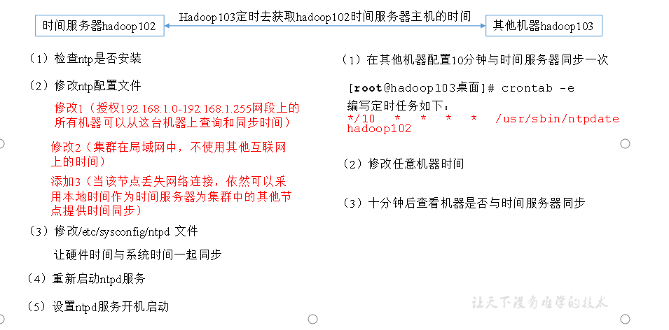

# ntp时间服务器设置

## 时间服务器图示

## 时间服务器配置

1.检查是否安装ntp时间服务器

~~~
[root@hadoop011 hadoop-2.7.2]# rpm -qa | grep ntp
ntpdate-4.2.6p5-10.el6.centos.x86_64
fontpackages-filesystem-1.41-1.1.el6.noarch
ntp-4.2.6p5-10.el6.centos.x86_64

~~~

2.修改ntp时间的配置信息

~~~
[root@hadoop011 etc]# vim /etc/ntp.conf 
修改内容如下
a）修改1（授权192.168.1.0-192.168.1.255网段上的所有机器可以从这台机器上查询和同步时间）
#restrict 192.168.1.0 mask 255.255.255.0 nomodify notrap为
restrict 192.168.109.0 mask 255.255.255.0 nomodify notrap

b）修改2（集群在局域网中，不使用其他互联网上的时间）
server 0.centos.pool.ntp.org iburst
server 1.centos.pool.ntp.org iburst
server 2.centos.pool.ntp.org iburst
server 3.centos.pool.ntp.org iburst为
#server 0.centos.pool.ntp.org iburst
#server 1.centos.pool.ntp.org iburst
#server 2.centos.pool.ntp.org iburst
#server 3.centos.pool.ntp.org iburst
c）添加3（当该节点丢失网络连接，依然可以采用本地时间作为时间服务器为集群中的其他节点提供时间同步）
server 127.127.1.0
fudge 127.127.1.0 stratum 10
~~~

3.修改/etc/sysconfig/ntpd 文件

~~~
[root@hadoop011 etc]# vim /etc/sysconfig/ntpd
增加内容如下（让硬件时间与系统时间一起同步）

SYNC_HWCLOCK=yes
~~~

4.重新启动ntpd服务

~~~
[root@hadoop011 etc]# service ntpd status
ntpd 已停
[root@hadoop011 etc]# service ntpd start
正在启动 ntpd：                                            [确定]
[root@hadoop011 etc]# service ntpd status
ntpd (pid  6519) 正在运行...

~~~

5.设置ntpd服务开机启动

~~~
[root@hadoop011 etc]# chkconfig ntpd on
记得把防火墙关了（或者把端口打开，不然其他服务器节点不能连接，会导致失败）
~~~

6.其他服务器节点到hadoop011时间服务节点上同步时间

~~~
[root@hadoop010 ~]# crontab -e
*/30 * * * * /usr/sbin/ntpdate hadoop011
                                         
crontab: installing new crontab
~~~

