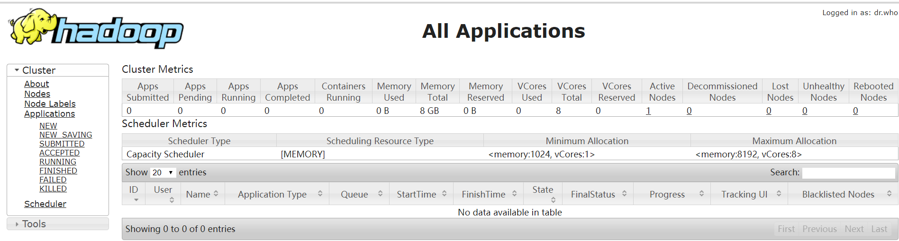

## 启动YARN并运行MapReduce程序

~~~
喜欢你，就是喜欢你。珍
~~~

### 分析

​	（1）配置集群在YARN上运行MR

​	（2）启动、测试集群增、删、查

​	（3）在YARN上执行WordCount案例

### 配置集群

1.配置yarn-env.sh

~~~
配置一下JAVA_HOME
[pw@hadoop102 hadoop-2.7.2]$ vim etc/hadoop/yarn-env.sh
~~~

2.配置yarn-site.xml

~~~
[pw@hadoop102 hadoop-2.7.2]$ vim etc/hadoop/yarn-site.xml 
<!-- Reducer获取数据的方式 -->
<property>
 		<name>yarn.nodemanager.aux-services</name>
 		<value>mapreduce_shuffle</value>
</property>

<!-- 指定YARN的ResourceManager的地址 -->
<property>
<name>yarn.resourcemanager.hostname</name>
<value>hadoop102</value>
</property>
~~~

3.配置：mapred-env.sh

~~~
[pw@hadoop102 hadoop-2.7.2]$ vim etc/hadoop/mapred-env.sh 
配置一下JAVA_HOME
export JAVA_HOME=/opt/module/jdk1.8.0_144
~~~

4.配置： (对mapred-site.xml.template重新命名为) mapred-site.xml

~~~
[pw@hadoop102 hadoop]$ mv mapred-site.xml.template  mapred-site.xml
[pw@hadoop102 hadoop]$ vim mapred-site.xml 
<!-- 指定MR运行在YARN上 -->
<property>
		<name>mapreduce.framework.name</name>
		<value>yarn</value>
</property>
~~~

### 启动集群

1.启动前必须保证NameNode和DataNode已经启动

~~~
[pw@hadoop102 hadoop-2.7.2]$ jps
2560 NameNode
2657 DataNode
2710 Jps

~~~

2.启动ResourceManager

~~~
[pw@hadoop102 hadoop-2.7.2]$ sbin/yarn-daemon.sh start resourcemanager

~~~

3.启动NodeManager

~~~
[pw@hadoop102 hadoop-2.7.2]$ sbin/yarn-daemon.sh start nodemanager

~~~

4.查看

~~~
[pw@hadoop102 hadoop-2.7.2]$ jps
3024 NodeManager
2560 NameNode
2657 DataNode
3138 Jps
2775 ResourceManager

~~~

### 集群操作

1.YARN的浏览器页面查看，如图2-35所示

<http://192.168.181.102:8088/cluster>

2.删除文件系统上的output文件

~~~
[pw@hadoop102 hadoop-2.7.2]$ bin/dhfs df -rm -R /user/pw/output

~~~

3.执行MapReduce程序

~~~
[pw@hadoop102 hadoop-2.7.2]$ bin/hadoop jar share/hadoop/mapreduce/hadoop-mapreduce-examples-2.7.2.jar wordcount /user/pw/input  /user/pw/output

~~~

4.查看运行结果，如图2-36所示

~~~
[pw@hadoop102 hadoop-2.7.2]$ bin/hdfs dfs -cat /user/pw/output/*
atguigu	2
hadoop	2
mapreduce	1
yarn	1
~~~

### **配置历史服务器**

为了查看程序的历史运行情况，需要配置一下历史服务器。具体配置步骤如下：

1. 配置mapred-site.xml

   ~~~
   [pw@hadoop102 hadoop-2.7.2]$ vim etc/hadoop/mapred-site.xml 
   
   在该文件里面增加如下配置：
   
   <!-- 历史服务器端地址 -->
   <property>
   <name>mapreduce.jobhistory.address</name>
   <value>hadoop102:10020</value>
   </property>
   <!-- 历史服务器web端地址 -->
   <property>
       <name>mapreduce.jobhistory.webapp.address</name>
       <value>hadoop101:19888</value>
   </property>
   ~~~

2.启动历史服务器

~~~

~~~

[atguigu@hadoop101 hadoop-2.7.2]$ sbin/mr-jobhistory-daemon.sh start historyserver

3. 查看历史服务器是否启动

   ~~~
   [pw@hadoop102 hadoop-2.7.2]$ sbin/mr-jobhistory-daemon.sh start historyserver
   
   ~~~

4. 查看JobHistory

   ~~~
   [pw@hadoop102 hadoop-2.7.2]$ jps
   3024 NodeManager
   2560 NameNode
   2657 DataNode
   4850 JobHistoryServer
   2775 ResourceManager
   4892 Jps
   ~~~

<http://hadoop102:19888/jobhistory/>

### **配置日志的聚集**

日志聚集概念：应用运行完成以后，将程序运行日志信息上传到HDFS系统上。

日志聚集功能好处：可以方便的查看到程序运行详情，方便开发调试。

注意：开启日志聚集功能，需要重新启动NodeManager 、ResourceManager和HistoryManager。

开启日志聚集功能具体步骤如下：

1. 配置yarn-site.xml

   ~~~
   在该文件里面增加如下配置。
   [pw@hadoop102 hadoop-2.7.2]$ vim etc/hadoop/yarn-site.xml 
   
   <!-- 日志聚集功能使能 -->
   <property>
   	<name>yarn.log-aggregation-enable</name>			<value>true</value>
   </property>
   <!-- 日志保留时间设置7天 -->
   <property>
   	<name>yarn.log-aggregation.retain-seconds</name>
   	<value>604800</value>
   </property>
   ~~~

2. 关闭NodeManager 、ResourceManager和HistoryManager

   ~~~
   [pw@hadoop102 hadoop-2.7.2]$ sbin/yarn-daemon.sh stop nodemanager
   [pw@hadoop102 hadoop-2.7.2]$ sbin/yarn-daemon.sh stop resourcemanager
   [pw@hadoop102 hadoop-2.7.2]$ sbin/mr-jobhistory-daemon.sh stop historyserver
   
   ~~~

3. 启动NodeManager 、ResourceManager和HistoryManager

   ~~~
   [pw@hadoop102 hadoop-2.7.2]$ sbin/yarn-daemon.sh start nodemanager
   [pw@hadoop102 hadoop-2.7.2]$ sbin/yarn-daemon.sh start resourcemanager
   [pw@hadoop102 hadoop-2.7.2]$ sbin/mr-jobhistory-daemon.sh start historyserver
   ~~~

4. 删除HDFS上已经存在的输出文件

   ~~~
   [pw@hadoop102 hadoop-2.7.2]$ bin/hdfs dfs -rm -R /user/pw/output
   
   ~~~

5. 执行WordCount程序

   ~~~
   pw@hadoop102 hadoop-2.7.2]$ hadoop jar share/hadoop/mapreduce/hadoop-mapreduce-examples-2.7.2.jar wordcount /user/pw/input /user/pw/output
   
   ~~~

6. 查看日志

   

