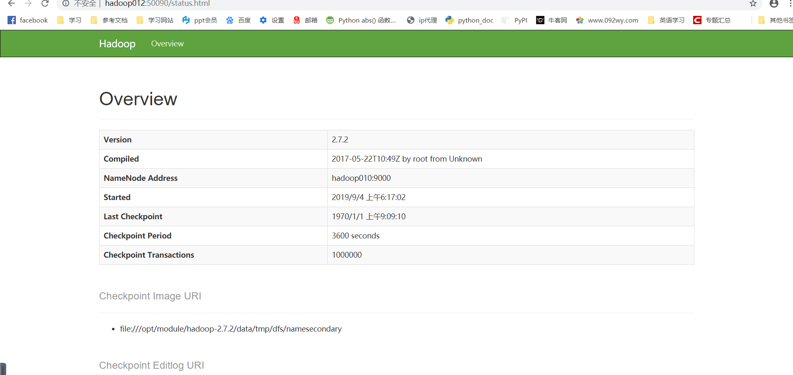

## 完全分布式搭建

~~~
你是谁，我的信念，这一切都结束吧
~~~

### 搭建规则

~~~
1）准备3台客户机（关闭防火墙、静态ip、主机名称）
2）安装JDK
3）配置环境变量
4）安装Hadoop
5）配置环境变量
6）配置集群
7）单点启动
8）配置ssh
9）群起并测试集群
~~~

### 准备活动（准备3台客户机）

1.克隆三台客户机

   配置静态ip：

~~~
配置网卡：
vim /etc/udev/rules.d/70-persistent-net.rules 
配置静态ip：
vim /etc/sysconfig/network-scripts/ifcfg-eth0 
修改主机名：
vim /etc/sysconfig/network
关闭防火墙：
service iptables stop
配置完后重启：
reboot
~~~

### 安装jdk

~~~

~~~

### 配置环境变量

~~~

~~~

### 配置集群

a.集群规划

|      | hadoop010         | hadoop011                   | hadoop012                  |
| ---- | ----------------- | --------------------------- | :------------------------- |
| HDFS | NameNode DataNode | DataNode                    | SecondaryName NodeDataNode |
| YARN | NodeManager       | ResourceManager NodeManager | NodeManager                |

2.修改集群配置文件

a.配置core-site.xml

~~~
[pw@hadoop010 hadoop-2.7.2]$ vim etc/hadoop/core-site.xml 

<!-- 指定HDFS中NameNode的地址 -->
<property>
		<name>fs.defaultFS</name>
      <value>hdfs://hadoop010:9000</value>
</property>

<!-- 指定Hadoop运行时产生文件的存储目录 -->
<property>
		<name>hadoop.tmp.dir</name>
		<value>/opt/module/hadoop-2.7.2/data/tmp</value>
</property>
~~~

b.HDFS配置文件

   配置hadoop-env.sh

~~~
[pw@hadoop010 hadoop-2.7.2]$ vim etc/hadoop/hadoop-env.sh
export JAVA_HOME=/opt/module/jdk1.8.0_144

~~~

配置hdfs-site.xml

~~~
[pw@hadoop010 hadoop-2.7.2]$ vim etc/hadoop/hdfs-site.xml 

<property>
		<name>dfs.replication</name>
		<value>3</value>
</property>

<!-- 指定Hadoop辅助名称节点主机配置 -->
<property>
      <name>dfs.namenode.secondary.http-address</name>
      <value>hadoop012:50090</value>
</property>
~~~

c.YARN配置文件

   配置yarn-env.sh

~~~
[pw@hadoop010 hadoop-2.7.2]$ vim etc/hadoop/yarn-env.sh
export JAVA_HOME=/opt/module/jdk1.8.0_144
~~~

  配置yarn-site.xml

~~~
[pw@hadoop010 hadoop-2.7.2]$ vim etc/hadoop/yarn-site.xml 
在该文件中增加如下配置
<!-- Reducer获取数据的方式 -->
<property>
		<name>yarn.nodemanager.aux-services</name>
		<value>mapreduce_shuffle</value>
</property>

<!-- 指定YARN的ResourceManager的地址 -->
<property>
		<name>yarn.resourcemanager.hostname</name>
		<value>hadoop011</value>
</property>
~~~

d. MapReduce配置文件

  	配置mapred-env.sh

~~~
[pw@hadoop010 hadoop-2.7.2]$ vim etc/hadoop/mapred-env.sh 
export JAVA_HOME=/opt/module/jdk1.8.0_144
~~~

​	配置mapred-site.xml

~~~
复制模板文件：
[pw@hadoop010 hadoop-2.7.2]$ cp etc/hadoop/mapred-site.xml.template  etc/hadoop/mapred-site.xml

[pw@hadoop010 hadoop-2.7.2]$ vim etc/hadoop/mapred-site.xml
<!-- 指定MR运行在Yarn上 -->
<property>
		<name>mapreduce.framework.name</name>
		<value>yarn</value>
</property>
~~~

### 在集群上分发配置好的Hadoop配置文件

~~~
首先确定hadoop文件修改权限群组为pw：然后执行脚本
[pw@hadoop010 module]$ xsync /opt/module/hadoop-2.7.2/
~~~

### 查看文件分发情况

~~~
[pw@hadoop011 opt]$ cat /opt/module/hadoop-2.7.2/etc/hadoop/core-site.xml 

~~~

## 集群单点启动

~~~
1.如果集群是第一次启动，需要格式化NameNode
[pw@hadoop010 hadoop-2.7.2]# bin/hdfs namenode -format

2.在hadoop010上启动NameNode
[pw@hadoop010 hadoop-2.7.2]# sbin/hadoop-daemon.sh start namenode

3.在hadoop010、hadoop011以及hadoop012上分别启动DataNode
[pw@hadoop010 hadoop-2.7.2]$ sbin/hadoop-daemon.sh start datanode
[pw@hadoop011 hadoop-2.7.2]$ sbin/hadoop-daemon.sh start datanode
[pw@hadoop012 hadoop-2.7.2]$ sbin/hadoop-daemon.sh start datanode

思考：每次都一个一个节点启动，如果节点数增加到1000个怎么办？

~~~

## 群起集群

1.配置slaves

~~~
[pw@hadoop010 ~]$ cd /opt/module/hadoop-2.7.2/etc/hadoop/
配置slaves文件：
[pw@hadoop010 hadoop]$ vim slaves 
hadoop010
hadoop011
hadoop012

[pw@hadoop010 hadoop]$ xsync slaves 

~~~

2.启动HDFS

~~~
[pw@hadoop010 hadoop-2.7.2]$ sbin/start-dfs.sh 
~~~

3.启动Yarn

~~~
[pw@hadoop011 hadoop-2.7.2]$ sbin/start-yarn.sh

~~~

4.Web端查看SecondaryNameNode

5.集群测试

~~~
创建文件夹：
[pw@hadoop010 hadoop-2.7.2]$ hdfs dfs -mkdir -p /user/pw/input
上传文件到集群
[pw@hadoop010 hadoop-2.7.2]$ hdfs dfs -put wcinput/wc.input /user/pw/input
下载文件：
[pw@hadoop010 hadoop-2.7.2]$ bin/hadoop fs -get /user/pw/input/hadoop-2.7.2.tar.gz ./
数据保存的位置：
在data文件夹中
~~~

