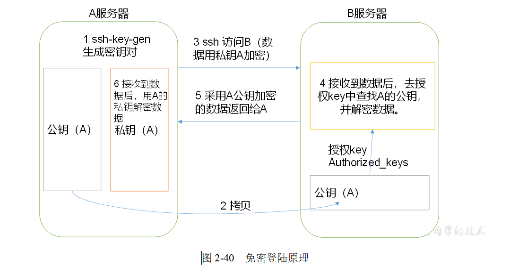

# 配置SSH无密登录

1.配置ssh

~~~

（1）基本语法
	ssh另一台电脑的ip地址
（2）ssh连接时出现Host key verification failed的解决方法
	[pw@hadoop011 ~]$ ssh hadoop010
	The authenticity of host 'hadoop010 (192.168.109.10)' can't be established.
	RSA key fingerprint is 58:77:cc:99:f7:3d:c9:30:c3:81:97:f9:47:9f:e5:1d.
	Are you sure you want to continue connecting (yes/no)? yes
	Warning: Permanently added 'hadoop010' (RSA) to the list of known hosts.
	pw@hadoop010's password: 

（3）解决方案如下：直接输入yes
~~~

2.无密钥配置

   原理图：

~~~
1.生成公钥和私钥：
	[pw@hadoop010 ~]$ ssh-keygen -t rsa
	然后敲（三个回车），就会生成两个文件id_rsa（私钥）、id_rsa.pub（公钥
2.将公钥拷贝到要免密登录的目标机器上
	[pw@hadoop010 .ssh]$ ssh-copy-id hadoop010
	[pw@hadoop010 .ssh]$ ssh-copy-id hadoop011
	[pw@hadoop010 .ssh]$ ssh-copy-id hadoop012

~~~

3..ssh文件夹下（~/.ssh）的文件功能解释

| known_hosts     | 记录ssh访问过计算机的公钥(public key) |
| --------------- | ------------------------------------- |
| id_rsa          | 生成的私钥                            |
| id_rsa.pub      | 生成的公钥                            |
| authorized_keys | 存放授权过得无密登录服务器公钥        |

